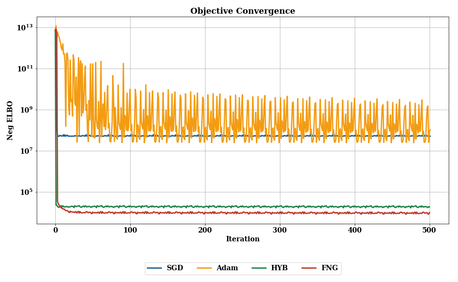

# Fully Natural Gradient Scheme for Improving Inference of the HetMOGP model

This repository contains an implementation of a Fully Natural Gradient (FullyNG) Scheme for improving optimisation of the Heterogeneous Multi-output Gaussian Process (HetMOGP) model (visit https://github.com/pmorenoz/HetMOGP for more details about the model). The FullyNG optimises the HetMOGP model using Natural Gradient optimisation for the posterior parameters and also Natural Gradients for the Hyper-Parameters (inducing points, kernel hyper-parameters and multi-output's corregionalisations parameters).

The repository consists of: 

- **fully_natural_gradient.py**: This module contains the functions **fullyng_opt_HetMOGP** and **hybrid_opt_HetMOGP**
- **load_datasets.py**: This module contains different toy examples with different number of Heterogeneous Outputs. 

The following modules are a Forked version of [Pablo Moreno](https://github.com/pmorenoz/HetMOGP)'s implementation. We recommend the user to work using this package version:
- **hetmogp**: This block contains all model definitions, inference, and important utilities. 
- **likelihoods**: General library of probability distributions for the heterogeneous likelihood construction.

## Usage

* Ones the HetMOGP model is created as:
```
model = SVMOGP(X=X, Y=Y, Z=Z, kern_list=kern_list, likelihood=likelihood, Y_metadata=Y_metadata, batch_size=batch)
```
Then we can bypass the model to the FullyNG optimiser. Apart from the model we shoul set the maximun number of iterations, the step-size parameter, momentum in the range \[0.0-1\], a lambda prior (usually \[0,1\] for inducing exploration in the inference process).

* Using FullyNG optimiser:
```
fullyng_opt_HetMOGP(model,Xval=None,Yval=None, max_iters=1000, step_size=0.01, momentum=0.9, prior_lambda=1.0e-10):
```
An alternative inference scheme is the Hybrid (NG + Adam) which optimises the HetMOGP model using Natural Gradient optimisation for the posterior parameters, but Adam for the Hyper-Parameters. We have to bypass the model to the hybrid optimiser, set the maximum number of iterations, the step-size parameter, decay_mom1 and decay_mom2 are parameters directly bypass to the Adam optimiser together with the step-size parameter, it is recommended to use the default values of decay_mom1=1-0.9 and decay_mom2=1-0.999.

* Using Hybrid (NG+Adam) optimiser:
```
hybrid_opt_HetMOGP(model,Xval=None,Yval=None, max_iters=1000, step_rate=0.01, decay_mom1=1-0.9,decay_mom2=1-0.999):
```

A complete example of our model usage can be found in this repository at **notebooks > FullyNG_on_ToyData**

## Examples
* **Heterogeneous Model using Five Outputs:** The figure shows the Performance for Objective Convergence Using Stochastic Gradient Descent (SGD), Adam (Adaptive Momentum Method), HYB (NG+Adam) and
Our FNG (Fully Natural Gradient) method.


## Contributors

[Juan-José Giraldo](https://github.com/juanjogg1987) and [Mauricio A. Álvarez](https://sites.google.com/site/maalvarezl/)

For further information or contact:
```
jjgiraldogutierrez1@sheffield.ac.uk or juanjogg1987@gmail.com
